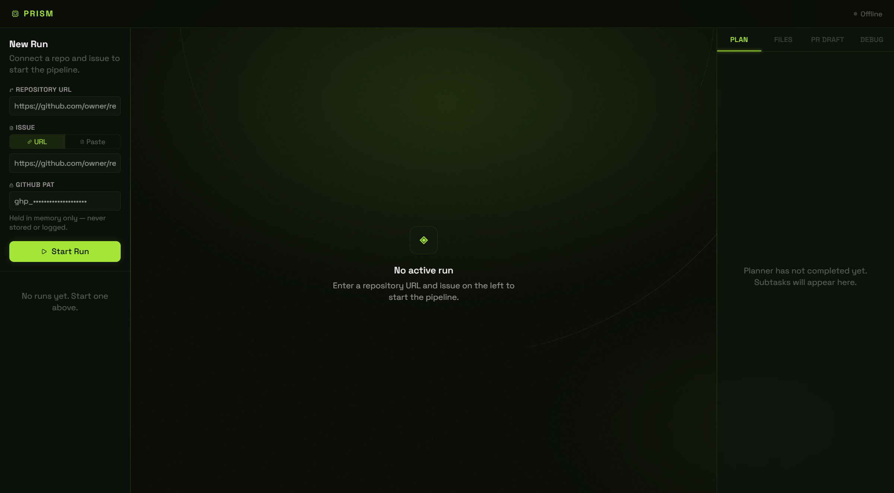
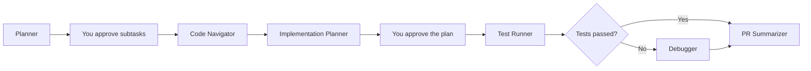
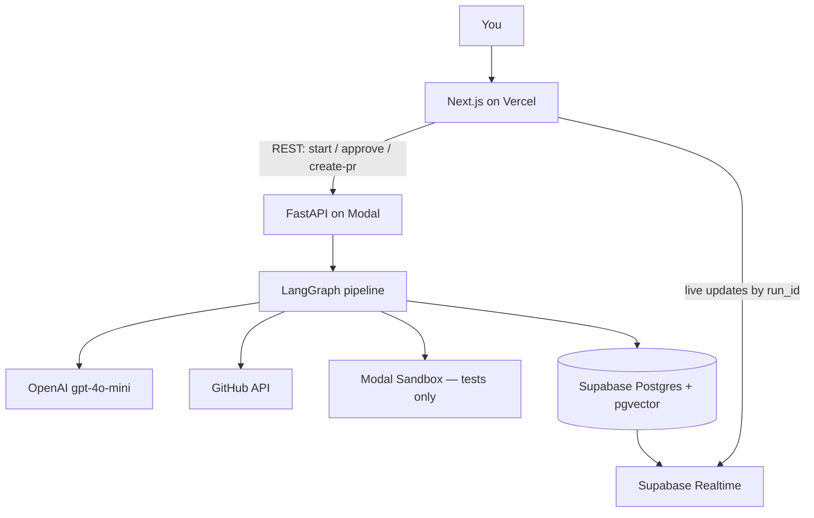

# Prism

**A multi-agent software engineering teammate.**

Give Prism a GitHub repository and an issue. It reads the codebase, breaks the work into subtasks, finds the relevant files, writes a step-by-step implementation plan, runs the test suite in an isolated sandbox, debugs failures, and drafts a professional pull request. You stay in control at two approval gates.

Prism plans and evaluates first. It does not silently rewrite your application.

[](https://prism-beta-one.vercel.app)
[](https://www.python.org/)
[](https://github.com/langchain-ai/langgraph)
[](https://fastapi.tiangolo.com/)
[](https://nextjs.org/)
[](https://supabase.com/)

**[Live demo](https://prism-beta-one.vercel.app)** · **[How the graph works](GRAPH.md)** · **[Architecture](ARCHITECTURE.md)** · **[API](API.md)**

<p align="center">
  
</p>

---

## Why this exists

Most AI coding tools jump straight to a patch. That looks fast in a demo and is hard to trust in a real repo.

Prism is built around a different thesis: **engineering judgment is the product.** A senior engineer does not start by writing code. They decompose the issue, locate the files that matter, plan the change, run tests, and only then describe the work in a pull request. Prism automates that loop — and pauses twice so a human can edit or stop the plan before anything expensive runs.

That makes this repo useful in two ways:

| If you are… | What to look at |
| --- | --- |
| A recruiter or hiring manager | The live demo, the six-agent pipeline below, and the tech stack. This is an end-to-end AI systems project, not a chatbot wrapper. |
| An engineer reviewing the code | Deterministic LangGraph routing, interrupt-based human-in-the-loop, a durable Postgres checkpointer, PAT never stored in the database, and tests that never run in the API process. |

---

## What a run looks like

1. Open the [live app](https://prism-beta-one.vercel.app) and paste a GitHub repo URL, an issue URL (or the issue text), and a GitHub personal access token.
2. **Planner** reads the issue, the file tree, and key config files, then proposes ordered subtasks with dependencies and likely files.
3. **You approve or edit** that breakdown (checkpoint 1).
4. **Code Navigator** maps each subtask to files using pgvector semantic search plus the GitHub API.
5. **Implementation Planner** writes a step-by-step plan: what to change, where, why, and the tradeoffs. It does not generate application code.
6. **You approve or revise** that plan (checkpoint 2). This is the last gate before tests run.
7. **Test Runner** clones the repo into a Modal sandbox, detects pytest / unittest / Jest, and runs the suite.
8. If tests fail, **Debugger** turns tracebacks into root causes and minimal fix proposals. If they pass, Debugger is skipped.
9. **PR Summarizer** writes a professional PR body from the full pipeline. Optionally, Prism opens a real GitHub PR with a `PRISM_REPORT.md` on a `prism/<run_id>` branch.

Typical wall time for a non-trivial repo is under five minutes, not counting how long you spend at the two approval screens.

---

## The six agents



| Agent | Job | LLM-heavy? |
| --- | --- | --- |
| **Planner** | Turns the issue + repo tree into ordered subtasks with dependencies, file hints, and complexity. | Yes |
| **Code Navigator** | Finds the files that actually matter. Semantic search over cached embeddings, plus GitHub path/keyword matching. | No — tools first |
| **Implementation Planner** | Writes an engineering plan per subtask: file, symbol, change, rationale, tradeoffs. | Yes |
| **Test Runner** | Clones the repo in `Modal.Sandbox` and runs the real suite. Never executes user code in the API process. | No |
| **Debugger** | Only if tests fail. Symptom → root cause → targeted fix proposal with a confidence score. | Yes |
| **PR Summarizer** | Composes title, what/why, test notes, limitations, and a review checklist. | Yes |

Two extra graph nodes — `hitl_1` and `hitl_2` — are not agents. They are **LangGraph interrupts**. The pipeline literally pauses, the UI shows an approval card, and FastAPI resumes the same `run_id` from a Postgres-backed checkpointer. That is required because the API runs on serverless Modal workers that do not keep memory between HTTP requests.

---

## How the system is put together



| Layer | Role |
| --- | --- |
| **Next.js (Vercel)** | Dark three-panel workspace. Left: sessions + run form. Center: live agent stream. Right: Plan / Files / PR Draft / Debug. |
| **FastAPI (Modal)** | Control plane. Creates a `run_id`, drives the graph, exposes status/output/approve/create-pr. |
| **LangGraph** | Eight-node `StateGraph` with one conditional edge after tests. Single compiled graph per process. |
| **Supabase** | System of record: runs, agent outputs, HITL payloads, embedding cache, and the LangGraph checkpointer. Realtime pushes agent start/complete events to the UI. |
| **OpenAI** | `gpt-4o-mini` for chat agents. `text-embedding-3-small` for Code Navigator. One cached factory in `backend/llm.py` — agents never instantiate their own client. |
| **LangSmith** | Auto-traces every graph run under project `prism`. |

REST is for **control**. Realtime is for **live UI**. There is no WebSocket or SSE endpoint on FastAPI, by design — serverless workers should not hold streaming connections.

---

## What this project is meant to demonstrate

These are the engineering choices a reviewer can verify in the repo:

- **Deterministic multi-agent orchestration** with LangGraph (`StateGraph`, explicit edges, conditional Debugger skip) rather than a loosely coupled agent chat.
- **Human-in-the-loop that survives serverless.** Interrupts + `AsyncPostgresSaver`. Approve resumes the same thread; it does not restart from scratch.
- **Real execution, not mocks.** Test Runner clones and runs tests in Modal Sandbox. Create-PR opens a real GitHub pull request.
- **Security boundaries.** The GitHub PAT is request-scoped (`config["configurable"]`), never a column in `PrismState`, never logged, never written to Supabase. User code never runs inside the FastAPI process.
- **Live product UI.** Typed Next.js client (`lib/api.ts` only — no `fetch()` in components), CSS tokens as the only color source, Supabase Realtime with HTTP polling fallback.
- **Observability.** LangSmith traces + structured `agent_outputs` rows the frontend already knows how to render.

---

## Tech stack

| | |
| --- | --- |
| Language | Python 3.11 (backend), TypeScript strict (frontend) |
| Agents | LangGraph, LangChain, OpenAI gpt-4o-mini / text-embedding-3-small |
| API | FastAPI + Pydantic, deployed with `@modal.asgi_app()` |
| Data | Supabase PostgreSQL, pgvector, Supabase Realtime, `langgraph-checkpoint-postgres` |
| Tests in isolation | Modal Sandbox (`pytest` / `unittest` / Jest) |
| Frontend | Next.js App Router, Tailwind for layout, CSS custom properties for color |
| GitHub | PyGitHub, PAT per session (no user accounts in MVP) |
| Tracing | LangSmith project `prism` |

---

## Repository map

```
Prism/
├── backend/                 FastAPI app, graph, agents, clients
│   ├── agents/              planner, navigator, impl planner, tests, debugger, PR, HITL
│   ├── graph.py             StateGraph assembly + Postgres checkpointer
│   ├── llm.py               Single cached ChatOpenAI factory
│   ├── routers/runs.py      start / status / output / approve / create-pr
│   └── state.py             PrismState TypedDict
├── frontend/                Next.js workspace UI
├── supabase/migrations/     Schema: runs, agent_outputs, hitl_checkpoints, embeddings
├── tests/                   Agent, graph, API, and contract tests
├── modal_app.py             Modal image, secrets, ASGI entrypoint
├── PRD.md                   Product requirements
├── ARCHITECTURE.md          System design
├── GRAPH.md                 Node/edge/state spec the backend follows
├── API.md                   HTTP contract
└── DECISIONS.md             ADRs (LangGraph, Modal, Realtime, PAT policy, …)
```

---

## API at a glance

| Method | Path | Purpose |
| --- | --- | --- |
| `POST` | `/api/runs/start` | Start a pipeline. Returns `run_id` immediately. |
| `GET` | `/api/runs/{id}/status` | Polling fallback for the live UI. |
| `GET` | `/api/runs/{id}/output` | Full artifacts (subtasks, file map, plan, tests, PR draft). |
| `POST` | `/api/runs/{id}/approve` | Resume after HITL 1 or 2 (approve / edit / stop). |
| `POST` | `/api/runs/{id}/create-pr` | Open a GitHub PR from the finished draft. |
| `GET` | `/health` | Liveness. |

PAT is sent in the JSON body on start, approve, and create-pr, used in-flight, and discarded. Responses never include it.

---

## Run it locally

You need **Python 3.11+**, **Node 18+**, a **Supabase** project, an **OpenAI** API key, and (for sandbox tests and deploy) a **Modal** account.

### 1. Backend

```bash
git clone https://github.com/Souravmane3000/Prism.git
cd Prism
python -m venv .venv
# Windows: .venv\Scripts\activate
# macOS/Linux: source .venv/bin/activate
pip install -e ".[dev]"
cp .env.example .env
```

Fill `.env` from [`.env.example`](.env.example). Run [`supabase/migrations/001_initial.sql`](supabase/migrations/001_initial.sql) in the Supabase SQL editor — it creates the tables, pgvector index, and Realtime publication.

```bash
uvicorn backend.main:app --reload --port 8000
```

API docs: [http://localhost:8000/docs](http://localhost:8000/docs)

```bash
pytest tests/ -q
```

### 2. Frontend

Create `frontend/.env.local`:

```bash
NEXT_PUBLIC_API_BASE_URL=http://localhost:8000
NEXT_PUBLIC_SUPABASE_URL=https://your-project.supabase.co
NEXT_PUBLIC_SUPABASE_ANON_KEY=eyJ...
```

```bash
cd frontend
npm install
npm run dev
```

Open [http://localhost:3000](http://localhost:3000).

### 3. Production-shaped deploy

```bash
modal deploy modal_app.py
```

Point `NEXT_PUBLIC_API_BASE_URL` at the Modal web URL and `FRONTEND_ORIGIN` at the Vercel origin. Production secrets live in a Modal Secret named `prism-secrets`.

**GitHub PAT (classic):** `repo` (private repos) or `public_repo`, plus the ability to read issues and open pull requests. Paste it in the UI per run. Do not commit it.

---

## Security

- GitHub PAT is never a field on `PrismState` (so the checkpointer cannot serialize it into Postgres).
- Agents that need GitHub read the token from LangGraph run config, not from the database.
- Only the last four characters may be stored as a hint for the UI.
- CORS is an allow-list of frontend origins, not `*`.
- Sandbox clones and test execution are isolated from the web worker.

---

## Docs

| Doc | Contents |
| --- | --- |
| [PRD.md](PRD.md) | Scope, user journey, success criteria |
| [ARCHITECTURE.md](ARCHITECTURE.md) | Components, data flow, deployment topology |
| [GRAPH.md](GRAPH.md) | Exact nodes, edges, state schema, HITL resume protocol |
| [API.md](API.md) | Request/response contracts |
| [DECISIONS.md](DECISIONS.md) | Why LangGraph, Modal, Realtime, per-session PAT, … |

---

Built by [Sourav Mane](https://github.com/Souravmane3000) as a production-shaped portfolio system — orchestration, HITL, sandboxing, embeddings, and a live UI in one repo.
